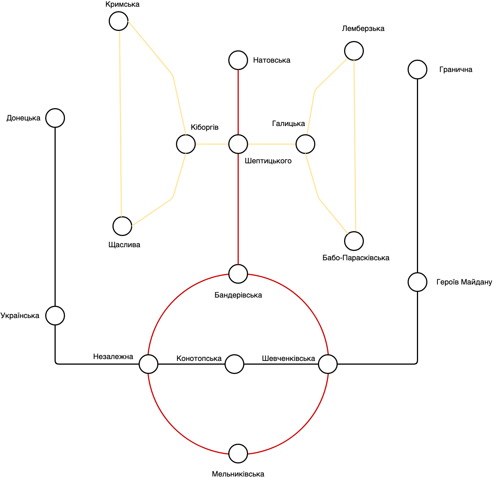

# Lviv metro info point

People of Lviv, asked you to build metro schedule info point. This program will help tourists city of Lviv to:

- calculate timing between two stations;
- calculate cost between two stations;

In the end, you should be able to:

- Load configuration data from config file
- Calculate timing between 2 stations
- Calculate cost between 2 stations

Here is the map of the stations:



### Use case:

The information about stations, metro lines and timing is stored in config file:

```
lines:
  - :black
  - :red
  - :yellow
stations:
  donetska:
    - :black
  ukrainska:
    - :black
  nezalezhna:
    - :black
    - :red
  konotopska:
    - :black
  shevchenkivska:
    - :black
    - :red
  heroiv_maidany:
    - :black
  granychna:
    - :black
  natovska:
    - :red
  banderivska:
    - :red
  melnykivska:
    - :red
  sheptyckogo:
    - :red
    - :yellow
  lemberska:
     - :yellow
  babo_paraskivska:
    - :yellow
  krymska:
    - :yellow
  shchaslyva:
    - :yellow
  halytska:
    - :yellow
  kiborgiv:
    - :yellow
```

Time and price defined for your variant can be found in file `timing.yml`

```
timing:
  -
    start: :donetska
    end: :ukrainska
    time: 6
    price: 3
  -
    start: :ukrainska
    end: :nezalezhna
    time: 4
    price: 2
  -
    start: :nezalezhna
    end: :konotopska
    time: 3
    price: 2.5
  -
    start: :konotopska
    end: :shevchenkivska
    time: 3
    price: 2.5
  -
    start: :shevchenkivska
    end: :heroiv_maidany
    time: 4
    price: 2
  -
    start: :heroiv_maidany
    end: :granychna
    time: 6
    price: 3
  -
    start: :nezalezhna
    end: :banderivska
    time: 3
    price: 2.5
  -
    start: :nezalezhna
    end: :melnykivska
    time: 3
    price: 2.5
  -
    start: :shevchenkivska
    end: :banderivska
    time: 3
    price: 2.5
  -
    start: :shevchenkivska
    end: :melnykivska
    time: 3
    price: 2.5
  -
    start: :banderivska
    end: :sheptyckogo
    time: 6
    price: 3
  -
    start: :sheptyckogo
    end: :natovska
    time: 5
    price: 2.3
  -
    start: :sheptyckogo
    end: :kiborgiv
    time: 2
    price: 1
  -
    start: :kiborgiv
    end: :krymska
    time: 7
    price: 3.5
  -
    start: :krymska
    end: :shchaslyva
    time: 8
    price: 4
  -
    start: :shchaslyva
    end: :kiborgiv
    time: 4
    price: 2
  -
    start: :sheptyckogo
    end: :halytska
    time: 2
    price: 1
  -
    start: :halytska
    end: :lemberska
    time: 6
    price: 3
  -
    start: :lemberska
    end: :babo_paraskivska
    time: 9
    price: 4.5
  -
    start: :babo_paraskivska
    end: :halytska
    time: 5
    price: 2.5
```

### Check your solution:

In order to verify your solution working as expected, please run next command with your variant:
```
gem install rspec

VARIANT=1 rspec metro_infopoint_spec.rb
...........

Finished in 0.00625 seconds (files took 0.14822 seconds to load)
11 examples, 0 failures
```

This command will test your code with automatic test suite.

### Tips:
You will earn extra points if your calculation will be optimal by time or price.

Please send us your code even if you haven't fully implemented all the requirements. We understand that the task may turn out to be more complex than it looks at first glance.

When making decisions about your code, keep in mind that the metropolitan may request certain changes in functionality in the future. Can your code design allow such changes easily?

What possible security issues do you see in the current app design?
